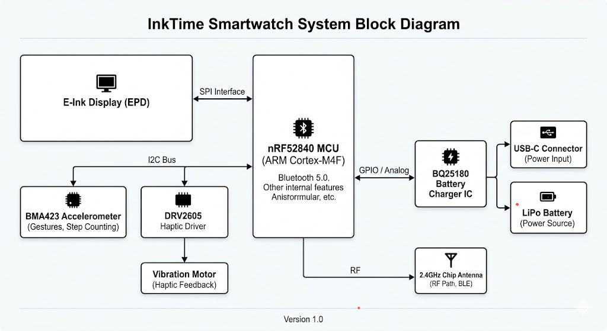

# Documentație Tehnică - InkTime Smartwatch
## Student: Drugea Casian 332CA

## 1. Descrierea Generală a Sistemului
Proiectul **InkTime** este un dispozitiv purtabil bazat pe microcontrolerul **nRF52840**, proiectat pentru a oferi o autonomie ridicată prin utilizarea unui ecran de tip E-Paper. Sistemul integrează funcționalități de monitorizare a mișcării, interfață haptică și un management avansat al energiei, fiind optimizat pentru dimensiuni reduse și eficiență.

## 2. Diagrama Bloc
Arhitectura hardware este structurată în jurul nucleului ARM Cortex-M4F, interconectat cu următoarele module:

* **Sistem de Procesare:** nRF52840 (Bluetooth 5.0, GPIO, SPI, I2C).
* **Afișaj:** E-Paper Display (EPD) cu circuit de drive integrat.
* **Senzori & Haptics:** Accelerometru BMA423 și Driver Haptic DRV2605.
* **Management Energie:** Încărcător LiPo BQ25180, Fuel Gauge MAX17048 și convertor DC/DC RT610A.
* **Interfață Utilizator:** Trei butoane de control (Up, Enter, Down).

    

## 3. Funcționalitate Hardware și Interfețe
Dispozitivul utilizează următoarele soluții tehnice pentru realizarea funcțiilor sale:

* **Microcontroler (nRF52840):** Gestionează stiva de comunicație Bluetooth și coordonează toți perifericii. S-a optat pentru acest model datorită consumului redus în modurile de repaus și a unității de calcul în virgulă mobila (FPU).
* **Afișaj E-Paper:** Este controlat prin interfața **SPI**. Circuitul de drive (bazat pe inductorul L5 și diodele MBR0530) asigură tensiunile necesare pentru actualizarea pixelilor.
* **Managementul Bateriei:**
    * **BQ25180:** Gestionează încărcarea prin USB-C și monitorizează curentul de intrare.
    * **MAX17048:** Monitorizează tensiunea celulei LiPo și oferă un algoritm de calcul al stării de încărcare (SoC) prin I2C.
    * **RT610A:** Un convertor Buck-Boost care stabilizează tensiunea la 3.3V, indiferent de nivelul de descărcare al bateriei.
* **Senzori și Actuatori:**
    * **BMA423:** Senzor de mișcare conectat prin I2C, utilizat pentru pedometru și gesturi.
    * **DRV2605:** Driver pentru motorul de vibrații, capabil să redea efecte haptice complexe.
* **Protecție și RF:** Linia USB-C este protejată de descărcări electrostatice prin **USBLC6-2SC6Y**. Antena ceramică de 2.4GHz este acordată prin componentele de matching (L4, C9) pentru o performanță optimă la 50 Ω.

## 4. Alocare Pini (Pinout nRF52840)

| Componentă | Pini MCU | Interfață | Justificare |
| :--- | :--- | :--- | :--- |
| **E-Paper (SPI)** | P0.17, P0.20, P0.22 | SPI | Transfer rapid de date pentru imagine. |
| **I2C Bus (Shared)** | P0.26 (SDA), P0.27 (SCL) | I2C | Conectează BMA423, DRV2605 și MAX17048. |
| **Butoane Fizice** | P0.11, P0.12, P0.24 | GPIO | Intrare digitală pentru navigație meniu. |
| **Battery Charger** | P0.02 | INT / Analog | Monitorizare status și întreruperi încărcare. |
| **Crystal 32kHz** | P0.00, P0.01 | XL1 / XL2 | Referință de timp pentru modurile Low Power. |

## 5. Fabricație și Fișiere de Producție
Dosarul proiectului include toate documentele necesare fabricării PCB-ului și asamblării (PCBA):

* **BOM (.bom):** Lista completă de componente cu link-uri către furnizori și coduri de comandă LCSC.
* **Gerber Files (.zip):** Straturile de cupru, masca de lipire, silkscreen-ul și fișierele de găurire (Drill).
* **Pick & Place (.cpl):** Coordonatele X-Y și rotația fiecărei componente pentru asamblarea automată.

## 6. Jurnal de Design și Decizii Tehnice
* **Utilizarea componentelor 0201:** Condensatorii de decuplare de sub nRF52840 sunt de mărime 0201 pentru a permite o rutare cât mai scurtă către masă și a economisi spațiu pe un PCB dens.
* **Traseele de alimentare și utilizarea VIA-urilor:** S-a optat pentru utilizarea trecerilor metalizate (vias) pe traseele de alimentare (V_BAT, 3.3V) pentru a facilita rutarea între straturi în zonele aglomerate. Justificarea tehnică rezidă în necesitatea de a menține o impedanță scăzută; în punctele de distribuție principală, s-au folosit mai multe via-uri în paralel pentru a crește capacitatea de transport a curentului și pentru a reduce inductanța parazită, prevenind astfel căderile de tensiune în timpul vârfurilor de consum (ex: refresh E-Ink sau transmisie RF).
* **Selecția Antenei:** S-a ales o antenă tip "Chip" pentru a reduce dimensiunea totală a carcasei, eliminând necesitatea unei antene imprimate pe PCB care ar fi ocupat o suprafață mai mare.
* **Erori de Suprapunere (Design Rule Check):** S-au ignorat erorile de suprapunere ale textului (silkscreen) în zonele critice ale conectorilor, prioritizând integritatea traseelor de semnal și a pad-urilor în detrimentul vizibilității etichetelor.

## 7. Structura Fișierelor
* `/Hardware`: Fișierele sursă `.sch` și `.brd`.
* `/Manufacturing`: Fișierele de producție (Gerber, BOM, CPL).
* `/Mechanical`: Modelul 3D al ansamblului complet (.step și .f3z).
* `/Images`: Randări ale dispozitivului și diagrame de sistem.